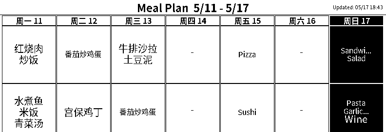

# E-Ink Meal Plan Display

**English** | [中文](README.zh-CN.md)

A weekly meal plan display for the **ELECROW CrowPanel ESP32-S3 5.79" E-Paper** ([Amazon](https://www.amazon.com/dp/B0FX4PDW6M)). A small Linux server (Raspberry Pi, NVIDIA Jetson, NUC, anything always-on) generates a meal-plan image from your data and serves it; the e-ink device pulls and displays it. Deep-sleep firmware on the ESP32-S3 makes it run for months on a small LiPo battery.

> 💡 **Companion project:** This repo is the *display front-end*. It reads meal-plan data from a SQLite database. The matching back-end where you actually plan meals is **[meal-planner](https://github.com/wenhao-anthropic/meal-planner)** — a self-hosted FastAPI app with a web UI for managing dishes, drag-and-drop weekly planning, grocery lists, and more. The two repos talk to each other purely through the SQLite file; you can also use this display with any other data source by rewriting one Python function (see [Plug in your data source](#plug-in-your-data-source) below).



## Features

- **Battery friendly** — ESP32-S3 deep-sleeps at ~10µA between updates. E-ink retains the image with zero power. A 2100mAh battery should last months.
- **Daily auto refresh** — Wakes once a day at a configured time (default 02:00 local), syncs NTP, fetches the current week's plan, redraws, sleeps.
- **Button navigation** — On-board rotary encoder lets you flip through past/future weeks; press to refresh; auto-sleeps after 2.5s of inactivity.
- **CJK ready** — Renders Chinese (or any Unicode) dish names using Noto Sans CJK.
- **Today highlight** — The current day's column is inverted (black background, white text) so it's easy to spot at a glance.
- **Pluggable data source** — Defaults to a SQLite schema described below; swap `get_meal_plan()` for any source (CalDAV, Google Sheets, REST API, etc.).
- **Web setup UI** — First boot exposes a WiFi captive-setup page; no hardcoded credentials in firmware.

## Architecture

```
 ┌────────────────────────┐    ┌──────────────────────┐    ┌──────────────────────────┐
 │  meal-planner          │    │  this repo           │    │  ESP32-S3 + E-paper      │
 │  (FastAPI web app)     │    │  (image renderer)    │    │  CrowPanel 5.79"         │
 │                        │    │                      │    │                          │
 │  • Browser UI for      │───▶│  • image_server.py   │◀───│  • Wakes daily at 02:00  │
 │    dish library,       │SQLite│  reads the DB        │HTTP│  • Or on button press    │
 │    weekly planning,    │ file │  • Renders 792x272   │ pull│  • Fetches image         │
 │    grocery list        │    │    1-bit BMP on demand│    │  • Displays              │
 │  • Writes plan to      │    │  • get_meal_plan()   │    │  • Deep-sleeps until next│
 │    SQLite              │    │    is the seam        │    │                          │
 └────────────────────────┘    └──────────────────────┘    └──────────────────────────┘
   github.com/.../meal-planner   ← this repo →                On your fridge
```

- The **meal-planner** server writes plans to `data/meal_planner.db` (SQLite).
- The **image server** in this repo reads that same database file and renders an image on each HTTP request.
- The **ESP32** is the active party — it wakes, pulls the image, displays it, and goes back to sleep.

You only need meal-planner if you want a nice web UI for editing meals. If you already maintain your meal plan elsewhere, you can skip meal-planner entirely and replace one function (see below).

## Hardware

| Part | Notes |
|------|-------|
| **ELECROW CrowPanel ESP32-S3 5.79" E-Paper** | Resolution 792x272 px, 1-bit B&W, dual SSD1683 controllers on a GDEY0579T93 panel ([product page](https://www.elecrow.com/crowpanel-esp32-5-79-e-paper-hmi-display-with-272-792-resolution-black-white-color-driven-by-spi-interface.html), [vendor GitHub](https://github.com/Elecrow-RD/CrowPanel-ESP32-5.79-E-paper-HMI-Display-with-272-792)). **The display does not ship with a battery** — buy one separately if you want battery operation. |
| **USB-C cable** | For flashing and charging |
| **Single-cell 3.7V LiPo (optional, for battery operation)** | The board uses a **JST SH 1.0mm 2-pin** battery connector. Any single-cell LiPo with a matching connector will work — e.g. [this 2100mAh battery I use](https://www.amazon.com/dp/B0F1TF89ZC). **Polarity is not standardized across vendors** — many batteries sold with "JST SH" connectors are wired with the opposite polarity, which will at best refuse to power the board and at worst damage it. Before plugging anything in, check the pinout against ELECROW's schematic and, if needed, carefully swap the two pins in the connector housing. The board has an LTC4054 charger so once it's connected correctly, any USB-C phone charger will top it up. |
| **Always-on server** | Anything with Python 3.8+ and a stable LAN IP. A Raspberry Pi Zero 2 W is more than enough. |

Pin map used by the firmware (from ELECROW's schematic):

| Function | GPIO |
|---|---|
| E-paper SCK / MOSI | 12 / 11 |
| E-paper CS / DC / RST / BUSY | 45 / 46 / 47 / 48 |
| **Screen power enable** | **7** (must be driven HIGH) |
| Rotary UP / DOWN / OK | 6 / 4 / 5 |
| HOME / EXIT buttons | 2 / 1 |

> ⚠️ **About GPIO 7**: the e-paper has no power until you drive GPIO 7 high. Many third-party "drop-in" sketches written for other ESP32 e-paper boards (e.g. LilyGo T5 4.7") will compile and run on this board but never refresh the display — that's the #1 gotcha.

## Repository layout

```
.
├── firmware/
│   └── meal_receiver/
│       └── meal_receiver.ino   # Deep-sleep ESP32-S3 firmware
├── sender/
│   ├── send_meal_plan.py        # CLI: generate image + push to device
│   ├── image_server.py          # HTTP server: device pulls images here
│   ├── update_display.sh        # cron-friendly wrapper around send_meal_plan.py
│   └── meal-image-server.service # systemd unit template
├── docs/
│   └── preview.png
├── LICENSE
└── README.md
```

## Setup

### 1. Server side

Requires Python 3.8+ and Pillow:

```bash
pip3 install Pillow
```

For Chinese dish names, install a CJK font. The script auto-detects Noto Sans CJK:

```bash
# Debian/Ubuntu/Raspberry Pi OS
sudo apt install fonts-noto-cjk

# Fedora
sudo dnf install google-noto-sans-cjk-fonts
```

#### Plug in your data source

##### Option A — Use the companion [meal-planner](https://github.com/wenhao-anthropic/meal-planner) app (recommended)

The matching back-end repo is a self-hosted FastAPI app that gives you a phone/tablet-friendly UI for managing dishes, drag-and-drop weekly meal planning, an auto-generated grocery list, and more. It writes its data to a SQLite file that this image server reads directly.

```bash
# Install both repos side by side
git clone https://github.com/wenhao-anthropic/meal-planner.git
git clone https://github.com/wenhao-anthropic/eink-meal-display.git

# Set up meal-planner per its own README, then point this server at its DB:
export MEAL_PLANNER_DB=/absolute/path/to/meal-planner/data/meal_planner.db
python3 eink-meal-display/sender/image_server.py
```

Both processes can run on the same always-on machine. They never talk over the network — they share a single SQLite file. SQLite handles concurrent readers (this server) + a single writer (meal-planner) just fine.

##### Option B — Bring your own database

If you maintain a database with the same schema, just point at it:

```sql
CREATE TABLE dish (
    id   INTEGER PRIMARY KEY,
    name TEXT NOT NULL
);

CREATE TABLE meal_plan (
    id          INTEGER PRIMARY KEY,
    week_start  TEXT NOT NULL,        -- 'YYYY-MM-DD' (must be a Monday)
    day_of_week INTEGER NOT NULL,     -- 0=Mon … 6=Sun
    meal_type   TEXT NOT NULL,        -- 'lunch' | 'dinner'
    dish_id     INTEGER NOT NULL REFERENCES dish(id)
);
```

```bash
export MEAL_PLANNER_DB=/path/to/your.db
```

##### Option C — Any other data source

If your meal plan lives in Google Sheets, Notion, a REST API, a YAML file, or anywhere else, rewrite the `get_meal_plan()` function in `sender/send_meal_plan.py` to return a dict shaped like:

```python
{
  "2026-04-13": {"lunch": ["Pasta", "Salad"], "dinner": ["Steak"]},
  "2026-04-14": {"lunch": [...],              "dinner": [...]},
  ...
}
```

Everything else (rendering, image server, ESP32 firmware) works unchanged.

#### Preview without a device

```bash
python3 sender/send_meal_plan.py --preview --output /tmp/preview.png
```

You'll get a 792x272 1-bit PNG you can open in any image viewer.

#### Start the image server

```bash
python3 sender/image_server.py
# Serving on 0.0.0.0:5000
```

For production, install the systemd unit (replace the placeholders first):

```bash
# Edit sender/meal-image-server.service and substitute:
#   <USER>      → your username
#   <REPO_DIR>  → absolute path to this repo
#   <PYTHON>    → output of `which python3`

sudo cp sender/meal-image-server.service /etc/systemd/system/
sudo systemctl daemon-reload
sudo systemctl enable --now meal-image-server
sudo systemctl status meal-image-server
```

### 2. Flash the firmware

In Arduino IDE 2.x on any machine connected to the display via USB-C:

1. **Add ESP32 boards**: File → Preferences → Additional Board Manager URLs:
   ```
   https://espressif.github.io/arduino-esp32/package_esp32_index.json
   ```
   Then Tools → Board → Boards Manager → install **"esp32" by Espressif Systems** (v3.0+ recommended).

2. **Install libraries** (Sketch → Include Library → Manage Libraries):
   - `GxEPD2` by Jean-Marc Zingg
   - `Adafruit GFX Library`
   - `Adafruit BusIO`

3. **Board settings** (Tools menu):
   - Board: **ESP32S3 Dev Module**
   - PSRAM: **OPI PSRAM**
   - Flash Size: **8MB**
   - Partition Scheme: **Huge APP (3MB No OTA / 1MB SPIFFS)**
   - USB CDC On Boot: **Enabled**

4. **Set your timezone** in `firmware/meal_receiver/meal_receiver.ino`:
   ```c
   const char* POSIX_TZ = "EST5EDT,M3.2.0,M11.1.0";  // change to your zone
   ```
   POSIX TZ syntax: see [GNU manual](https://www.gnu.org/software/libc/manual/html_node/TZ-Variable.html). Common examples:
   - US Eastern: `"EST5EDT,M3.2.0,M11.1.0"`
   - US Pacific: `"PST8PDT,M3.2.0,M11.1.0"`
   - UTC: `"UTC0"`
   - Central Europe: `"CET-1CEST,M3.5.0,M10.5.0/3"`
   - China: `"CST-8"`

5. Open `firmware/meal_receiver/meal_receiver.ino` and click Upload. If upload fails, hold the BOOT button on the board, click Upload, release BOOT when "Connecting…" appears.

### 3. First-boot configuration

After flashing, the device boots into AP setup mode (no saved WiFi):

1. Display shows: `Setup Mode — WiFi: MealDisplay / 12345678 — Open 192.168.4.1`.
2. On your phone or laptop, join the WiFi network **`MealDisplay`** with password **`12345678`**.
3. In a browser, open **<http://192.168.4.1>**:
   - **Image Server** → enter your server's LAN IP (e.g. `192.168.1.50`) and port (`5000`). Save.
   - **WiFi** → enter your home WiFi SSID and password. Save & Reboot.
4. The device reboots, joins your home WiFi, pulls the current week's image, displays it, and goes to sleep.

A small status line appears at the bottom of the display showing fetch time and next scheduled wake — handy for sanity-checking the schedule without a serial monitor.

## Daily operation

- Once configured, the device runs unattended. It wakes once a day at the configured time (default 02:00 local), pulls the latest image, and sleeps again until tomorrow.
- The on-board rotary encoder is active whenever you press it: **up** = previous week, **down** = next week, **press** = refresh current week. After 2.5 seconds of no activity, it sleeps again.
- The push-based flow is still available for testing or ad-hoc updates:
  ```bash
  python3 sender/send_meal_plan.py --ip 192.168.1.42
  ```
  This will only succeed if the device happens to be awake (e.g. you just pressed a button).

## Configuration reference

### Wake time

In `firmware/meal_receiver/meal_receiver.ino`:

```c
#define WAKE_HOUR    2   // 0–23
#define WAKE_MINUTE  0
```

### Active timeout

```c
#define ACTIVE_TIMEOUT 2500  // ms of button inactivity before deep-sleep
```

### Server endpoints (`image_server.py`)

| Endpoint | Description |
|---|---|
| `GET /meal_image?offset=0` | Raw 1-bit bitmap for current week (26928 bytes) |
| `GET /meal_image?offset=-1` | Previous week |
| `GET /meal_image?offset=1` | Next week |
| `GET /health` | Returns `OK` |

### Device endpoints (AP setup mode only)

| Endpoint | Description |
|---|---|
| `GET /` | HTML setup page |
| `POST /wifi` | Save WiFi credentials, reboot |
| `POST /server` | Save image-server IP / port |
| `GET /reset` | Forget WiFi, reboot to AP mode |

## Power budget

| State | Current |
|---|---|
| Deep sleep | ~10 µA |
| Wake → WiFi → fetch → draw (≈10 s) | ~150 mA |
| Active button mode (≤2.5 s after last press) | ~150 mA |

A 2100 mAh LiPo should comfortably last several months with one daily wake and occasional button use.

## Troubleshooting

**Display never refreshes after upload.**
GPIO 7 (screen power) is not being driven HIGH. This firmware does that explicitly. If you've adapted the code, make sure `enableDisplayPower()` runs before anything else.

**Status line shows UTC time instead of local time.**
The POSIX TZ string isn't being applied. The firmware calls `setenv("TZ", …)` *after* `configTime()` returns; if you reordered them, swap them back.

**Compile error: `'ESP_GPIO_WAKEUP_GPIO_LOW' was not declared`**.
You're on an older ESP32 Arduino core. The firmware uses `esp_sleep_enable_ext1_wakeup(mask, ESP_EXT1_WAKEUP_ANY_LOW)` instead — make sure your local copy reflects that.

**Upload fails with `termios.error: (22, 'Invalid argument')` on macOS.**
Re-seat the USB-C cable, reselect the port in Tools → Port, or try a different cable (some are charge-only). If that fails, hold BOOT during upload.

**Display IP changes every reboot.**
Reserve a DHCP lease for the device's MAC in your router, or change the firmware to use a static IP. For most home setups, a DHCP reservation is simplest.

**Battery monitoring / charge status?**
The ELECROW board does **not** route the battery voltage to any ADC pin, and the LTC4054 `CHRG` status pin isn't wired to a GPIO either. There's no software-readable battery state without a hardware mod (soldering a 100k/100k divider from the BAT pad to a free ADC GPIO).

## Adapting to other displays

The image generation and serving code is generic — it produces any-size 1-bit bitmaps. To target a different e-paper:

1. Change `DISPLAY_WIDTH`/`DISPLAY_HEIGHT` in `send_meal_plan.py` and `image_server.py` calls to match your panel.
2. Swap the `GxEPD2_BW<…>` template parameter in the firmware to your panel's GxEPD2 class (see the [GxEPD2 list](https://github.com/ZinggJM/GxEPD2#supported-spi-e-paper-panels-from-good-display)).
3. Update the pin defines.

## Credits

- E-paper driving: [GxEPD2](https://github.com/ZinggJM/GxEPD2) by Jean-Marc Zingg.
- ELECROW for the hardware and their [reference repo](https://github.com/Elecrow-RD/CrowPanel-ESP32-5.79-E-paper-HMI-Display-with-272-792).
- Built in close collaboration with Claude (Anthropic).

## License

MIT — see [LICENSE](LICENSE).
